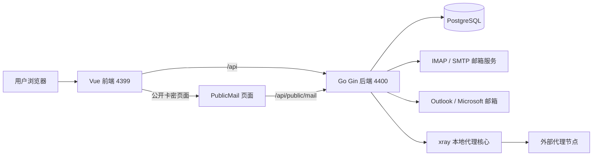
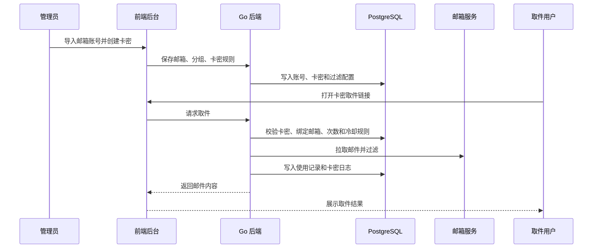

<div align="center">
  
  <h1>MailPlus 管理系统</h1>
  <p><strong>IMAP / Outlook 邮箱管理 · 卡密取件 · 代理系统 · 自托管后台</strong></p>

  <p>
    
    
    
    
    
  </p>

  <p>
    
    
    
    
  </p>

  <p>
    Docker 一键部署 · 多架构镜像 · 共用 PostgreSQL 多开 · 数据备份恢复
  </p>
</div>

---

## ✨ 特性

- 🔐 **卡密取件**：生成卡密、绑定邮箱、限制次数、设置关键词和邮件天数过滤。
- 📬 **IMAP 邮箱管理**：账号分组、批量导入、导出、测试、收件、发件、备注。
- 📨 **Outlook / Microsoft 邮箱管理**：支持 OAuth 授权、批量导入、收件、导出和测试连接。
- 🌐 **代理系统**：支持 HTTP、SOCKS5、VMess、VLESS，内置 xray 转换本地代理。
- 🧾 **使用日志**：记录卡密、绑定邮箱、邮件标题、使用 IP 和使用时间。
- 🧰 **后台管理**：仪表盘、用户管理、系统设置、个人资料、任务中心和备份导出。
- 🐳 **Docker 发布**：前端、后端打包到同一个应用镜像，配合 PostgreSQL 一条命令启动。
- 🔁 **多开友好**：支持普通独立多开，也支持多个应用共用一个 PostgreSQL 容器。
- 🧱 **多架构镜像**：支持 `linux/amd64`、`linux/arm64`、`linux/arm/v7`。

## 🚀 快速部署

### 下载 compose 并启动

服务器已安装 Docker 和 Docker Compose 后执行：

```bash
mkdir -p MailPlus
cd MailPlus

curl -L -o docker-compose.yml https://raw.githubusercontent.com/douliu676/MailPlus/main/docker-compose.yml

docker compose up -d
```

如果服务器没有 `curl`，可以用 `wget`：

```bash
mkdir -p MailPlus
cd MailPlus

wget -O docker-compose.yml https://raw.githubusercontent.com/douliu676/MailPlus/main/docker-compose.yml

docker compose up -d
```

访问地址：

```text
http://服务器IP:4399
```

默认后台账号：

```text
admin / admin123
```

> ⚠️ 首次部署后请立即修改默认密码。

## 📦 默认镜像

| 服务 | 镜像 |
| --- | --- |
| MailPlus | `douliu676/mailplus:v1.0.1` |
| PostgreSQL | `postgres:16-alpine` |

MailPlus 已发布为多架构镜像，用户安装时 Docker 会根据设备类型自动选择：

```text
linux/amd64
linux/arm64
linux/arm/v7
```

## 🧾 版本说明

### v1.0.0

- 卡密取件：生成卡密、绑定邮箱、限制次数、关键词过滤、邮件天数过滤。
- IMAP 邮箱管理：账号分组、批量导入、导出、测试连接、收件、发件和备注。
- Outlook / Microsoft 邮箱管理：OAuth 授权、批量导入、收件、导出和测试连接。
- 代理系统：支持 HTTP、SOCKS5、VMess、VLESS，并通过内置 xray 转换为本地代理。
- 后台能力：卡密日志、用户管理、系统设置、个人资料、任务中心和 Docker 一键部署。
- 部署能力：支持普通独立多开和共用 PostgreSQL 多开，镜像支持 `linux/amd64`、`linux/arm64`、`linux/arm/v7`。

### v1.0.1

- 数据库备份新增定时备份和手动备份，支持本地保存，也支持开启 WebDAV 后同步上传。
- 备份保留份数默认改为 3 份，本地和 WebDAV 都会按保留份数清理。
- 查看备份窗口支持显示文件名、文件大小、创建时间，并提供下载和删除操作。
- 恢复备份完成后会自动重启程序，兼容开发模式、Docker 和 Windows 启动器。
- WebDAV 测试连接和备份上传失败会进入任务中心显示，方便排查异常。
- 代理切换会先测试节点，测试成功后再切换，并提示切换成功和延迟。

## 🧰 常用命令

| 操作 | 命令 |
| --- | --- |
| 启动 | `docker compose up -d` |
| 查看容器 | `docker compose ps` |
| 查看日志 | `docker compose logs -f` |
| 重启 | `docker compose restart` |
| 停止 | `docker compose down` |
| 拉取新镜像 | `docker compose pull` |
| 更新并重启 | `docker compose pull && docker compose up -d` |

## 🔁 多开说明

MailPlus 支持两种多开方式：

| 方式 | 说明 | 适合场景 |
| --- | --- | --- |
| 普通多开 | 每套应用配一套 PostgreSQL | 隔离最清楚，适合普通用户 |
| 共用 PostgreSQL 多开 | 多个应用共用一个 PostgreSQL 容器，每套用不同数据库名 | 节省容器数量，适合熟悉 Docker 的用户 |

### 普通单开

默认 `docker-compose.yml` 是普通单开版本，包含：

```text
mail
mail-postgres
```

需要改端口时，只改冒号左边的宿主机端口：

```yaml
ports:
  - "4399:4399"
```

例如把前端宿主机端口改成 `4499`：

```yaml
ports:
  - "4499:4399"
```

后端 `4400` 只在容器内部使用，不需要暴露到宿主机。

### 共用 PostgreSQL 多开

如果想多个 MailPlus 共用一个 PostgreSQL 容器，下载多开模板：

```bash
mkdir -p MailPlus
cd MailPlus

curl -L -o docker-compose.shared-postgres.yml https://raw.githubusercontent.com/douliu676/MailPlus/main/docker-compose.shared-postgres.yml

docker compose -f docker-compose.shared-postgres.yml up -d
```

默认仍然是单开，只启用：

```text
mail
mail-postgres
mail-shared-postgres-db-init-1
```

`mail-shared-postgres-db-init-1` 是数据库初始化容器，执行完成后显示停止是正常的。

多开时取消注释 `app_1`、`app_2`，并确认这些内容不重复：

| 配置 | 示例 |
| --- | --- |
| 容器名 | `mail`、`mail_1`、`mail_2` |
| 前端宿主机端口 | `4399`、`4499`、`4599` |
| 数据库名 | `mail_admin`、`mail_admin_1`、`mail_admin_2` |

共用 PostgreSQL 时不要复制这些内容：

```text
postgres
mail-postgres
postgres_data
```

## 💾 数据备份

单开默认数据库名是 `mail_admin`。

### 备份单个数据库

```bash
mkdir -p backup
docker exec mail-postgres pg_dump -U postgres -d mail_admin > backup/mail_admin_$(date +%Y%m%d_%H%M%S).sql
```

### 恢复单个数据库

```bash
cat backup/mail_admin_20260615_234500.sql | docker exec -i mail-postgres psql -U postgres -d mail_admin
```

其中 `20260615_234500` 换成你真实备份文件名里的时间。

查看已有备份：

```bash
ls backup
```

恢复最新一个 `mail_admin` 备份：

```bash
cat $(ls -t backup/mail_admin_*.sql | head -n 1) | docker exec -i mail-postgres psql -U postgres -d mail_admin
```

### 完整备份 PostgreSQL

```bash
mkdir -p backup
docker exec mail-postgres pg_dumpall -U postgres > backup/postgres_all_$(date +%Y%m%d_%H%M%S).sql
```

恢复整个 PostgreSQL：

```bash
cat backup/postgres_all_20260615_234500.sql | docker exec -i mail-postgres psql -U postgres
```

## 🔐 数据库密码

可以在 compose 文件同目录创建 `.env`：

```env
POSTGRES_PASSWORD=请改成强密码
TZ=Asia/Shanghai
```

然后启动：

```bash
docker compose up -d
```

已经初始化过的 PostgreSQL 数据卷不会因为修改 `.env` 自动改旧密码。生产环境建议首次启动前就设置好强密码。

## 🧱 技术栈

| 层 | 技术 |
| --- | --- |
| 🎨 前端 | Vue 3、Vite、TypeScript、Tailwind CSS、Vue Router |
| 🧠 请求状态 | TanStack Vue Query |
| 🧩 图标 | lucide-vue-next |
| ⚙️ 后端 | Go 1.26、Gin、Ent |
| 🗄️ 数据库 | PostgreSQL 16 |
| 🔐 认证 | bcrypt、服务端会话 |
| 🌐 代理 | xray core |
| 🐳 容器 | Docker、Docker Compose、Buildx |

## 📁 文件说明

```text
MailPlus/
├─ docker-compose.yml                  普通单开部署文件
├─ docker-compose.shared-postgres.yml  共用 PostgreSQL 的多开模板
├─ Dockerfile                          Docker 镜像构建文件
├─ frontend-server.js                  容器内前端静态服务
├─ start.sh                            容器启动脚本
├─ houduan/                            Go 后端源码
└─ qianduan/                           Vue 前端源码
```

## 🧭 思路图

### 整体架构



### 卡密取件流程



## 🐳 发布镜像

构建并推送多架构镜像：

```bash
docker buildx build \
  --platform linux/amd64,linux/arm64,linux/arm/v7 \
  -t douliu676/mailplus:v1.0.1 \
  -t douliu676/mailplus:latest \
  --push .
```

检查镜像架构：

```bash
docker buildx imagetools inspect douliu676/mailplus:v1.0.1
docker buildx imagetools inspect douliu676/mailplus:latest
```

看到下面三个平台就表示正常：

```text
linux/amd64
linux/arm64
linux/arm/v7
```

## 🔗 主要入口

| 路径 | 说明 |
| --- | --- |
| `/home` | 首页 |
| `/login` | 登录页 |
| `/admin/dashboard` | 仪表盘 |
| `/admin/accounts` | IMAP 邮箱管理 |
| `/admin/outlook-accounts` | 微软邮箱管理 |
| `/admin/proxy-system` | 代理系统 |
| `/admin/card-keys` | 卡密系统 |
| `/admin/card-key-logs` | 卡密日志 |
| `/admin/users` | 用户管理 |
| `/admin/settings` | 系统设置 |
| `/imap/mail/` | IMAP 快速取件 |
| `/outlook/mail/` | Outlook 快速取件 |
| `/mail/keys=:cardKey` | 公开卡密取件 |

## 🔌 主要 API

| 接口 | 说明 |
| --- | --- |
| `GET /api/health` | 健康检查 |
| `POST /api/auth/login` | 登录 |
| `GET /api/settings/public` | 公开站点设置 |
| `GET /api/public/mail/:key` | 读取卡密公开信息 |
| `POST /api/public/mail/:key/messages` | 公开卡密取件 |
| `GET /api/public/mail/:key/all` | 纯文本公开取件 API |
| `GET /api/admin/update-check` | 检查 GitHub Releases 最新版本 |
| `/api/admin/mail-accounts` | IMAP 邮箱账号管理 |
| `/api/admin/outlook-accounts` | Outlook / Microsoft 邮箱账号管理 |
| `/api/admin/proxy/*` | 代理系统 |
| `/api/admin/card-keys` | 卡密管理 |
| `/api/admin/card-key-logs` | 卡密日志 |
| `/api/admin/users` | 用户管理 |
| `/api/admin/settings` | 系统设置 |
| `/api/admin/backup/export` | 数据备份导出 |

## 🗺️ 路线图

**核心功能（已实现）**

- [x] 🔐 卡密系统（分组 / 生成 / 绑定邮箱 / 次数限制 / 关键词过滤）
- [x] 📬 IMAP 邮箱管理（增 / 删 / 改 / 查 / 测试连接）
- [x] 📨 Outlook / Microsoft 邮箱管理（OAuth / 批量导入 / 收件 / 导出）
- [x] 📁 分组管理（树形分组 / 排序 / 状态筛选）
- [x] 📦 批量导入 / 导出 / 删除 / 移组
- [x] 📤 邮件发送（SMTP 发信）
- [x] 📥 邮件读取（实时收件 / 搜索 / HTML 渲染）
- [x] 🌐 代理系统（HTTP / SOCKS5 / VMess / VLESS / xray 转换）
- [x] 🧾 卡密日志（卡密 / 绑定邮箱 / 邮件标题 / IP / 时间）
- [x] 👤 用户管理（管理员 / 普通用户 / 启用禁用）
- [x] ⚙️ 系统设置（站点信息 / Logo / 备份 / 分页 / 日志清理）
- [x] 🧰 任务中心（导入导出任务 / 下载结果 / 清理结果）
- [x] 🐳 Docker 镜像发布（前端 + 后端 + 多架构镜像）
- [x] 🔁 多实例运行（同设备多开，端口和数据库隔离）
- [x] 🗄️ 共用 PostgreSQL 多开模板
- [x] 🔎 GitHub Releases 版本检查

**计划中（欢迎 PR）**

- [ ] 🧭 更完整的首次安装向导
- [ ] 🔑 更细的角色权限控制
- [ ] 📚 更完整的 API 文档
- [ ] 🧩 更多邮箱服务商预设
- [ ] 🚀 自动化发布流水线

> ⚠️ 部署多套实例时，请确保前端宿主机端口和数据库名全部分开；否则会出现端口占用或数据混用。

## ❓ 常见问题

### 为什么有一个 db-init 容器是停止状态？

`db-init` 是数据库初始化容器，用来自动创建多开需要的数据库。它执行完就会退出，停止是正常现象。

### 安装时会自动选择设备架构吗？

会。`douliu676/mailplus` 是多架构镜像，Docker 会根据服务器 CPU 自动拉取对应版本。

### 这个程序推荐用什么 PostgreSQL 版本？

推荐使用 **PostgreSQL 16**，镜像标签为 `postgres:16-alpine`。

### 可以用 postgres:latest 吗？

不建议。数据库大版本升级可能导致已有数据卷无法直接启动。默认使用 `postgres:16-alpine` 更稳。

### 如何升级 MailPlus？

先修改 compose 里的镜像版本号，例如把 `v1.0.0` 改成 `v1.0.1`，然后执行：

```bash
docker compose pull
docker compose up -d
```

## ⚠️ 免责声明

本项目仅用于学习、测试和管理自己拥有合法授权的邮箱资源。请勿用于未授权访问、垃圾邮件、撞库、绕过服务商限制或其他违法违规用途。使用本项目产生的风险和责任由使用者自行承担。
